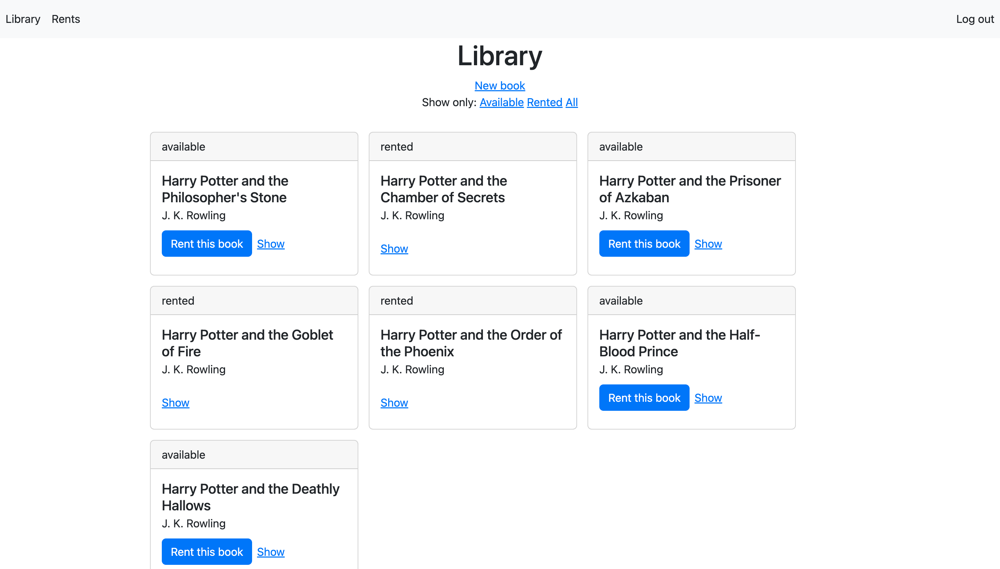
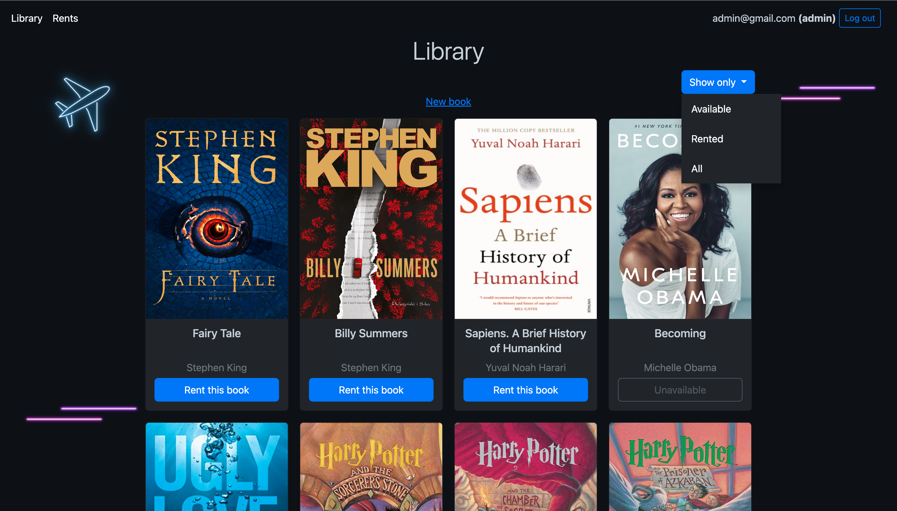
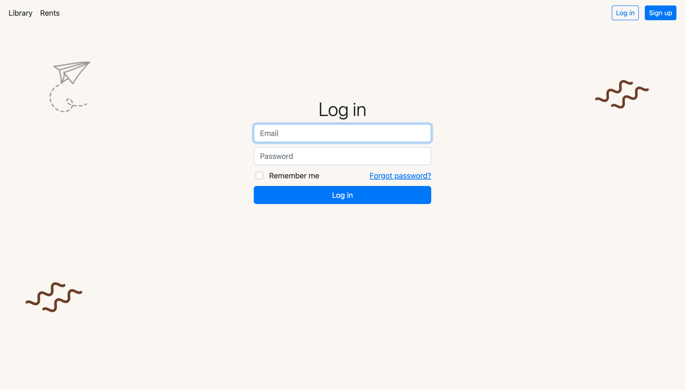
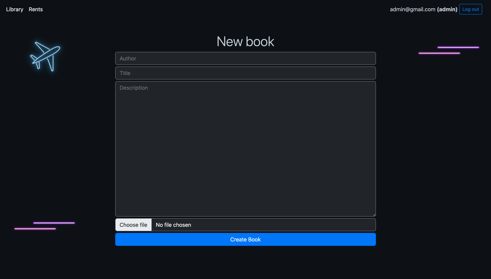
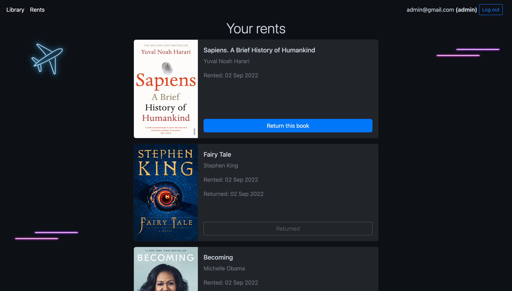

# 📖 Library Project

The project introduces library application which might be used by librarians and readers. You can watch it live at [Fly.io](https://icy-sea-3390.fly.dev/). Most of the functions are available for registered users. To make it simpler you can use the following accounts: <br>

#### Librarian:
Email: admin@gmail.com <br>
Password: qwerty

#### Reader:
Email: user@gmail.com <br>
Password: qwerty

## Screenshots

<hr>

<hr>

<hr>

<hr>



## ✏️ Description

- Every user can glance through the list of books in the library
- He can registrate and then log in to his account
- Once it's done, a user can rent books but only these with 'available' status
- Rented books are shown in their own tab, where users can return books
- Users cannot get access to other users' rents
- There is a special admin/librarian role which allows to add, edit and delete books.

## 🛠 Tech Stack

- Ruby
- Rails
- PostgreSQL

**Gems:**
- Devise
- Bootstrap
- Sass Rails
- Pagy
- Rspec
- Shoulda-matchers
- Factory Bot
- Capybara
- Faker

### 🛠 Launching
Install gems:
```
bundle install
```
Migrate the database:
```
rails db:migrate
```
Seed the database:
```
rails db:seed
```
Run the application:
```
rails s
```

## 🚨 Tests

To run tests:
```
rspec
```
